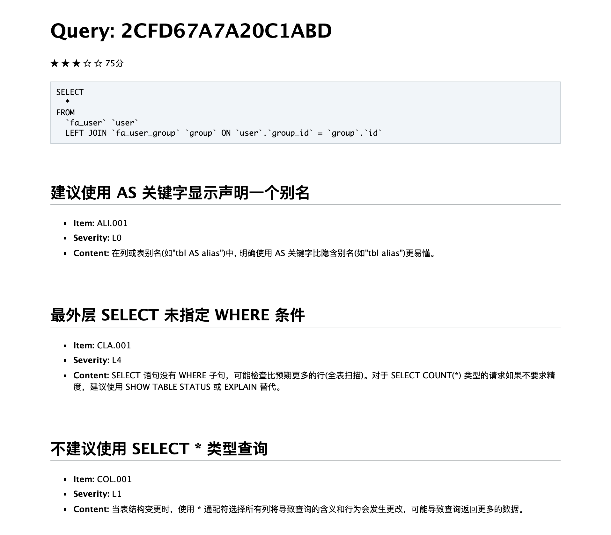
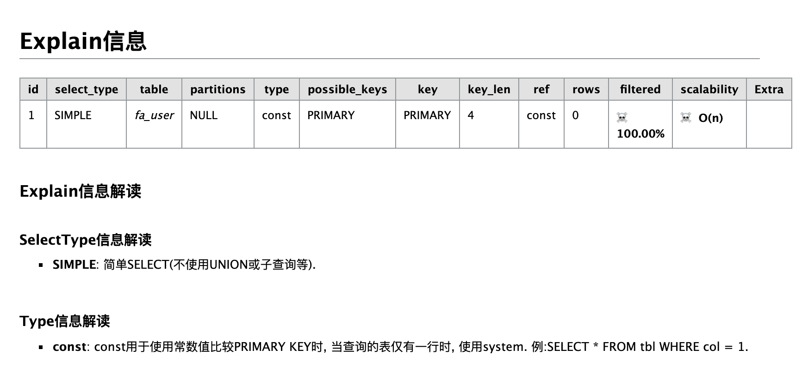

<h1 align="center">soar-php</h1>

<p align="center">
    <a href="README.md">简体中文</a> |
    <a>ENGLISH</a>
</p>

<p align="center">SQL statement optimizer and rewriter</p>

> **[soar-php](https://github.com/guanguans/soar-php)** is a PHP extension package based on Xiaomi's open source [soar](https://github.com/XiaoMi/soar) development. It is a SQL statement tuning development tool for PHP engineers.

[](https://travis-ci.org/guanguans/soar-php)
[](https://scrutinizer-ci.com/g/guanguans/soar-php/build-status/master)
[](https://scrutinizer-ci.com/g/guanguans/soar-php/?branch=master)
[](https://codecov.io/gh/guanguans/soar-php)
[](https://github.styleci.io/repos/178793017)
[](https://packagist.org/packages/guanguans/soar-php)
[](https://packagist.org/packages/guanguans/soar-php)
[](https://packagist.org/packages/guanguans/soar-php)

## Requirements

* PHP >= 7.1
* ext-pdo

## Used in the framework

- [x] Laravel - [laravel-web-soar](https://github.com/huangdijia/laravel-web-soar)
- [x] ThinkPHP - [think-soar](https://github.com/guanguans/think-soar)
- [x] Hyperf - [hyperf-soar](https://github.com/wilbur-oo/hyperf-soar)
- [ ] Yii2
- [ ] Symfony
- [ ] Slim

## Installation

``` shell
$ composer require guanguans/soar-php --dev
```

## Usage

### Download [XiaoMi](https://github.com/XiaoMi/) open source SQL optimizer [soar](https://github.com/XiaoMi/soar/releases), please refer to [soar install](https://github.com/XiaoMi/soar/blob/master/doc/install.md) for more detailed installation(*If you do not use a custom ear path, ignore this step*)

``` bash
# macOS
$ wget https://github.com/XiaoMi/soar/releases/download/0.11.0/soar.darwin-amd64
# linux
$ wget https://github.com/XiaoMi/soar/releases/download/0.11.0/soar.linux-amd64
# windows
$ wget https://github.com/XiaoMi/soar/releases/download/0.11.0/soar.windows-amd64
# Download with other commands or downloader
```

### Initial configuration, please refer to [soar config](https://github.com/XiaoMi/soar/blob/master/doc/config.md) for more detailed configuration

#### 一、The runtime initialization configuration

``` php
<?php

require __DIR__.'/vendor/autoload.php';

use Guanguans\SoarPHP\Soar;

$config = [
    // The package comes with a soar path OR a custom soar path
    '-soar-path' => OsHelper::isWindows() ? 'vendor/guanguans/soar-php/bin/soar.windows-amd64' : (OsHelper::isMacOS() ? 'vendor/guanguans/soar-php/bin/soar.darwin-amd64' : 'vendor/guanguans/soar-php/bin/soar.linux-amd64'),
    // '-soar-path' => '/Users/yaozm/Documents/wwwroot/soar-php/soar.darwin-amd64',
    // Test environment configuration
    '-test-dsn' => [
        'host' => '127.0.0.1',
        'port' => '3306',
        'dbname' => 'database',
        'username' => 'root',
        'password' => '123456',
    ],
    // log output file
    '-log-output' => './soar.log',
    // Report output format: default markdown [markdown, html, json]
    '-report-type' => 'html',
];
$soar = new Soar($config);
```

#### 二、Configuration file initial config

Create file `.soar.dist` or `.soar` in the `vendor` same directory , content reference [.soar.example](.soar.example), for example:

``` php
<?php
return [
    // The package comes with a soar path OR a custom soar path
     '-soar-path' => OsHelper::isWindows() ? 'vendor/guanguans/soar-php/bin/soar.windows-amd64' : (OsHelper::isMacOS() ? 'vendor/guanguans/soar-php/bin/soar.darwin-amd64' : 'vendor/guanguans/soar-php/bin/soar.linux-amd64'),
    // '-soar-path' => '/Users/yaozm/Documents/wwwroot/soar-php/soar.darwin-amd64',
    // Test environment configuration
    '-test-dsn' => [
        'host' => '127.0.0.1',
        'port' => '3306',
        'dbname' => 'database',
        'username' => 'root',
        'password' => '123456',
    ],
    // log output file
    '-log-output' => './soar.log',
    // Report output format: default markdown [markdown, html, json]
    '-report-type' => 'html',
];
```

Then initialize

``` php
<?php

require __DIR__.'/vendor/autoload.php';

use Guanguans\SoarPHP\Soar;

$soar = new Soar();
```

#### Configure priority: `runtime initiali config` > `.soar` > `.soar.dist`

### SQL score

**Method call:**

``` php
$sql ="SELECT * FROM `fa_user` `user` LEFT JOIN `fa_user_group` `group` ON `user`.`group_id`=`group`.`id`;";
echo $soar->score($sql);
```

**Output results:**



### explain information

**Method call:**

``` php
$sql = "SELECT * FROM `fa_auth_group_access` `aga` LEFT JOIN `fa_auth_group` `ag` ON `aga`.`group_id`=`ag`.`id`;";
// Output html format
echo $soar->htmlExplain($sql);
// Output markdown format
echo $soar->mdExplain($sql);
// Output html format
echo $soar->explain($sql, 'html');
// Output markdown format
echo $soar->explain($sql, 'md');
```

**Output results:**



### Grammar check

**Method call:**

``` php
$sql = 'selec * from fa_user';
echo $soar->syntaxCheck($sql);
```

**Output results:**

``` sql
At SQL 1 : line 1 column 5 near "selec * from fa_user" (total length 20)
```

### SQL fingerprint

**Method call:**

``` php
$sql = 'select * from fa_user where id=1';
echo $soar->fingerPrint($sql);
```

**Output results:**

``` sql
select * from fa_user where id = ?
```

### SQL pretty

**Method call:**

``` php
$sql = 'select * from fa_user where id=1';
var_dump($soar->pretty($sql));
```

**Output results:**

``` sql
SELECT  
  * 
FROM  
  fa_user  
WHERE  
  id  = 1;
```

### Markdown to html

**Method call:**

``` php
echo $soar->md2html("## this is a test");
```

**Output results:**

``` html
...
<h2>this is a test</h2>
...
```

### Soar help

**Method call:**

``` php
var_dump($soar->help());
```

**Output results:**

``` yaml
···
'Usage of /Users/yaozm/Documents/wwwroot/soar-php/soar:
  -allow-charsets string
    	AllowCharsets (default "utf8,utf8mb4")
  -allow-collates string
    	AllowCollates
  -allow-drop-index
    	AllowDropIndex, 允许输出删除重复索引的建议
  -allow-engines string
    	AllowEngines (default "innodb")
  -allow-online-as-test
    	AllowOnlineAsTest, 允许线上环境也可以当作测试环境
  -blacklist string
    	指定 blacklist 配置文件的位置，文件中的 SQL 不会被评审。
···    
```

### Execute any `soar` command

**Method call:**

``` php
$command = "echo '## 这是另一个测试' | /Users/yaozm/Documents/wwwroot/soar-php/soar.darwin-amd64 -report-type md2html";
echo $soar->exec($command);
```

**Output results:**

``` html
...
<h2>This is another test'</h2>
...
```

## Contributors ✨

Thanks goes to these wonderful people ([emoji key](https://allcontributors.org/docs/en/emoji-key)):

<!-- ALL-CONTRIBUTORS-LIST:START - Do not remove or modify this section -->
<!-- prettier-ignore -->
<table>
  <tr>
    <td align="center"><a href="http://blog.charmingkamly.cn"><br /><sub><b>kamly</b></sub></a><br /><a href="https://github.com/guanguans/soar-php/issues?q=author%3Akamly" title="Bug reports">🐛</a></td>
    <td align="center"><a href="http://leslieeilsel.com/"><br /><sub><b>Leslie Lau</b></sub></a><br /><a href="https://github.com/guanguans/soar-php/issues?q=author%3Aleslieeilsel" title="Bug reports">🐛</a></td>
    <td align="center"><a href="https://github.com/huangdijia"><br /><sub><b>D.J.Hwang</b></sub></a><br /><a href="#ideas-huangdijia" title="Ideas, Planning, & Feedback">🤔</a></td>
  </tr>
</table>

<!-- ALL-CONTRIBUTORS-LIST:END -->

This project follows the [all-contributors](https://github.com/all-contributors/all-contributors) specification. Contributions of any kind welcome!

## Reference link

* [https://github.com/XiaoMi/soar](https://github.com/XiaoMi/soar)，[XiaoMi](https://github.com/XiaoMi)

## License

[MIT](LICENSE)